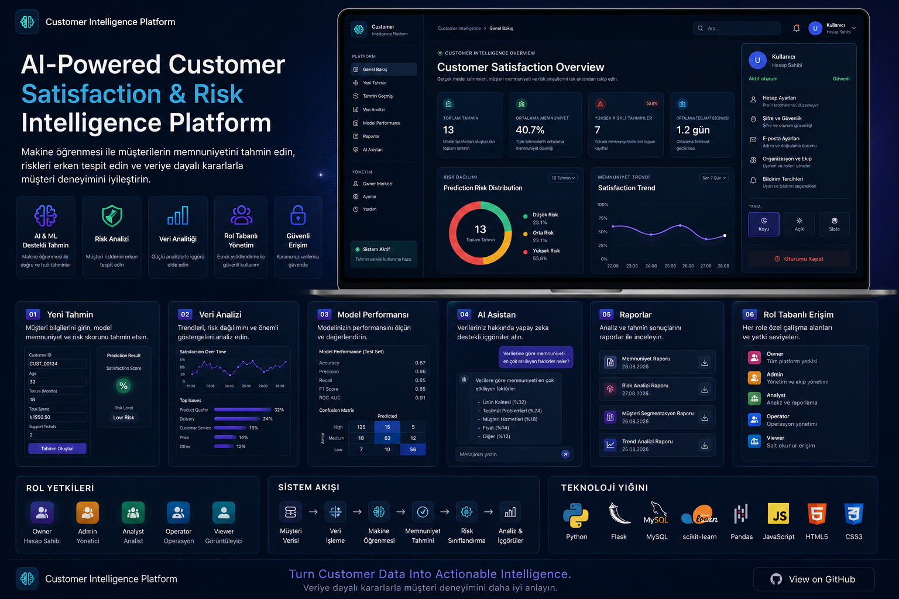

# Customer Intelligence Platform

<p align="center">
  
</p>

<p align="center">
  <strong>Customer Satisfaction Prediction, Business Analytics & AI-Assisted Intelligence Platform</strong>
</p>

<p align="center">
  A machine learning–driven web platform that combines predictive analytics,
  Google Gemini AI, MySQL-based data analysis and role-based access control
  in a Flask application.
</p>

---

## Overview

**Customer Intelligence Platform** is a machine learning–driven web application that I developed using the **Olist Brazilian E-Commerce Public Dataset**.

The project started with the analysis and preparation of raw relational e-commerce data and gradually evolved into a complete web platform where machine learning predictions can be generated, stored, analyzed and interpreted.

The application integrates a trained customer satisfaction model with a Flask backend and MySQL database. Prediction results are transformed into operational risk levels and presented through dashboards, analytical views, prediction history and reporting interfaces.

I also integrated **Google Gemini AI** into the platform to provide an AI-assisted analysis experience. For platform-related questions, current application data can be retrieved from MySQL and included as context before the request is sent to Gemini.

In addition to the machine learning and analytics components, the platform includes authentication, organization management, invitation-based membership and backend-enforced role-based authorization.

---

# Platform Highlights

- Machine learning–based customer satisfaction prediction
- Satisfaction and dissatisfaction probability analysis
- Automatic customer risk classification
- Interactive business dashboard
- Prediction history and traceability
- Customer and transaction analytics
- Google Gemini AI integration
- Context-aware AI Assistant
- MySQL database integration
- User authentication
- Organization management
- Organization invitation system
- Role-Based Access Control (RBAC)
- Role-specific user interfaces
- Reports and model performance views
- Light and dark interface support

---

# Machine Learning Prediction

The core prediction system estimates customer satisfaction using order, payment, product and delivery-related information.

When a prediction request is submitted, the application validates the input and sends the prepared features to the trained machine learning model.

The prediction response includes:

- Predicted satisfaction class
- Satisfaction probability
- Dissatisfaction probability
- Operational risk level
- Unique prediction identifier

Production predictions are stored in MySQL so that they can later be used throughout the dashboard, analytics and history sections.

The prediction flow can be summarized as:

```text
Customer / Order Information
            ↓
      Input Validation
            ↓
      Feature Processing
            ↓
   Machine Learning Model
            ↓
 Satisfaction Probabilities
            ↓
     Risk Classification
            ↓
       MySQL Storage
            ↓
 Dashboard / Analytics / History
```

---

# Customer Risk Classification

Raw model probabilities are converted into operational risk categories to make prediction results easier to interpret.

The current risk classification logic uses the predicted dissatisfaction probability:

| Dissatisfaction Probability | Risk Level |
|---|---|
| Below 40% | Low Risk |
| 40% – 59.9% | Medium Risk |
| 60% and above | High Risk |

This creates a clearer connection between machine learning output and operational decision-making.

Instead of displaying only a probability value, the platform provides an immediately understandable risk interpretation for each prediction.

---

# Dashboard

The main dashboard acts as the central monitoring interface of the platform.

It retrieves prediction data from MySQL and transforms the stored records into business-oriented indicators and visual summaries.

Current dashboard metrics include:

- Total Predictions
- Average Satisfaction
- High-Risk Predictions
- High-Risk Percentage
- Average Delivery Delay
- Risk Distribution
- Satisfaction Trend
- Recent Predictions

The dashboard is designed to provide a quick overview of both prediction activity and customer satisfaction risk without requiring users to inspect individual database records.

---

# Data Analytics

The Analytics section provides aggregated analysis of the predictions stored in the platform.

Instead of focusing only on individual predictions, this section examines patterns across multiple business dimensions.

Current analytical areas include:

### Customer State Analysis

Prediction results can be aggregated according to customer state, including:

- Prediction count
- Average satisfaction
- Average delivery delay
- High-risk customer count
- High-risk percentage

### Product Category Analysis

Product categories can be compared using:

- Prediction volume
- Average satisfaction
- Average dissatisfaction

### Payment Analysis

Payment-related statistics include:

- Payment method distribution
- Prediction count
- Average satisfaction
- Average order value
- Average installment count

### Delivery Analysis

Delivery performance includes:

- Average delivery time
- Average delivery delay
- Delayed predictions
- On-time predictions
- Early deliveries
- Delivery percentages

### General Business Statistics

Additional aggregated metrics include:

- Average order value
- Average freight cost
- Average product count
- Average category count
- Average product price
- Average product weight
- Average product photo count

---

# Google Gemini AI Integration

The platform includes an AI Assistant powered by the **Google Gemini API**.

Rather than functioning only as a general chatbot, the assistant can distinguish between general questions and questions related to the Customer Intelligence Platform.

For platform-related questions, the Flask backend retrieves relevant current information from MySQL and prepares it as structured context before sending the request to Gemini.

```text
User Question
      ↓
Question Classification
      ↓
 ┌──────────────────────────────┐
 │ Platform-related question?   │
 └──────────────┬───────────────┘
                │
          Yes   │   No
                │
       ┌────────┴────────┐
       ↓                 ↓
 Retrieve MySQL      General Question
 Platform Data
       ↓                 ↓
 Build Context        Gemini API
       ↓                 ↓
       └────────┬────────┘
                ↓
          Gemini Response
                ↓
           AI Assistant
```

For platform-related questions, the assistant can work with available information such as:

- Dashboard metrics
- Risk distribution
- Recent predictions
- Product category statistics
- Customer satisfaction results

The system instruction also prevents the assistant from inventing customer or order records that are not available in the provided platform context.

For general questions, unnecessary database queries are avoided and Gemini can respond normally.

### Gemini Configuration

The integration uses the **Google Gen AI SDK**.

The API key is loaded from an environment variable:

```text
GEMINI_API_KEY
```

The key is never written directly into the application source code or returned through the API.

The project also provides an AI health endpoint for checking whether the Gemini integration is configured without exposing the API key.

---

# Authentication

The application contains its own authentication system built with Flask sessions and MySQL.

Supported functionality includes:

- User registration
- User login
- User logout
- Password hashing
- Session-based authentication
- Protected routes
- Active-user validation
- Organization membership validation

Passwords are hashed before being stored in the database.

Authentication status is also revalidated against the database for protected application routes.

---

# Organization Management

The platform uses an organization-based account structure.

When a user creates a new account, an organization is created and the first user becomes the organization's **Owner**.

Organization data and membership information are stored separately, allowing authorization to be based on the user's role inside the organization.

The organization system currently supports:

- Organization creation
- Organization information
- Organization membership
- Team member listing
- Role assignment
- Member activation and deactivation
- Permission-controlled organization management

This structure makes the application closer to a multi-user business platform rather than a single-user prediction interface.

---

# Role-Based Access Control

The application implements backend-enforced **Role-Based Access Control (RBAC)**.

Five organization roles are currently supported:

| Role | Main Responsibility | Access |
|---|---|---|
| **Owner** | Organization ownership and management | Full platform access |
| **Admin** | Team and administrative operations | Extended management access |
| **Analyst** | Analytics and model analysis | Analytical access |
| **Operator** | Customer prediction workflows | Operational access |
| **Viewer** | Monitoring and reporting | Read-oriented access |

Access restrictions are enforced directly by Flask route decorators.

For example, prediction operations are available to:

```text
Owner
Admin
Operator
```

Analytics can be accessed by:

```text
Owner
Admin
Analyst
Viewer
```

Model performance is restricted to:

```text
Owner
Admin
Analyst
```

The AI Assistant is available to:

```text
Owner
Admin
Analyst
Operator
```

This means authorization does not depend only on hiding menu items in the frontend.

The backend independently verifies the user's current organization membership and role before protected operations are executed.

---

# Role-Specific User Experience

The interface also adapts according to the authenticated user's role.

Instead of displaying the same workflow to every user, the platform provides role-specific areas and actions based on the user's responsibilities.

The current role structure includes:

- **Owner** — organization and platform management
- **Admin** — administrative and team operations
- **Analyst** — analytical workflows
- **Operator** — prediction-focused workflows
- **Viewer** — monitoring and read-oriented workflows

This separates operational, analytical and administrative responsibilities while keeping authorization rules centralized in the backend.

---

# Organization Invitation System

Team membership is managed through an invitation-based workflow.

When an authorized organization user adds a new team member, the application creates a secure invitation.

Invitation tokens are generated using cryptographically secure random values.

The raw token itself is not stored directly in MySQL. Instead, the application stores its **SHA-256 hash**.

The invitation workflow includes:

```text
Organization Manager
        ↓
Create Team Member
        ↓
Generate Secure Token
        ↓
Store SHA-256 Token Hash
        ↓
Create Expiration Time
        ↓
Invitation Link
        ↓
User Creates Password
        ↓
Membership Activated
```

Invitations also have an expiration period and cannot be reused after they have been accepted.

---

# Prediction History

Production predictions are persisted in MySQL and can later be reviewed from the Prediction History page.

Stored information includes customer/order-related features together with model outputs such as:

- Prediction ID
- Prediction date
- Customer state
- Payment information
- Product information
- Order values
- Delivery information
- Satisfaction probability
- Dissatisfaction probability
- Risk level

This provides traceability between prediction requests and historical model results.

---

# Model Performance

The platform contains a dedicated **Model Performance** section for examining the machine learning component separately from operational prediction screens.

The purpose of this section is to provide a clear distinction between:

- Using the model for predictions
- Monitoring customer intelligence results
- Evaluating the underlying machine learning model

---

# Reports

The Reports section provides a separate view for reviewing prediction and analytical information.

Report data is generated from stored prediction records and includes information such as:

- Dashboard metrics
- Risk distribution
- Category statistics
- Recent predictions

This creates a dedicated reporting layer in addition to the main operational dashboard.

---

# Machine Learning Workflow

The machine learning development process is organized into dedicated Jupyter Notebooks.

Each notebook represents a different stage of the data and modeling workflow.

## 01 — Data Understanding

The first stage focuses on understanding the structure and quality of the original Olist datasets.

Main tasks include:

- Dataset inspection
- Dimension analysis
- Data type inspection
- Missing value analysis
- Duplicate detection
- Dataset relationship analysis
- Initial data quality assessment

---

## 02 — Data Cleaning

The raw datasets are cleaned and standardized before further analysis.

Main operations include:

- Missing value handling
- Duplicate control
- Data type conversion
- Format standardization
- Dataset validation
- Clean dataset preparation

---

## 03 — Exploratory Data Analysis

Exploratory Data Analysis is used to investigate customer, transaction and delivery patterns before model development.

Analysis areas include:

- Customer purchasing behavior
- Payment behavior
- Product categories
- Order values
- Customer satisfaction
- Delivery performance
- Correlation analysis
- Business-oriented observations

---

## 04 — Feature Engineering

The cleaned relational datasets are transformed into features suitable for machine learning.

Feature groups include:

- Customer-related features
- Order-level features
- Product-level features
- Payment features
- Delivery-related features
- Time-based features
- Aggregated transaction features

The workflow also addresses:

- Target variable preparation
- Missing value handling
- Information leakage prevention
- Train-test dataset preparation

---

## 05 — Machine Learning Modeling

The modeling stage focuses on developing the customer satisfaction classification system.

The workflow includes:

- Data preprocessing
- Categorical feature handling
- Numerical feature preparation
- Model training
- Model comparison
- Performance evaluation
- Final model selection

The selected production model is serialized using **Joblib** and loaded by the application for inference.

---

# System Architecture

The application connects the presentation layer, Flask backend, machine learning model, MySQL database and Gemini integration.

```text
                         ┌──────────────────────┐
                         │        User          │
                         └──────────┬───────────┘
                                    │
                                    ▼
                         ┌──────────────────────┐
                         │    Web Interface     │
                         │ HTML / CSS / JS      │
                         └──────────┬───────────┘
                                    │
                                    ▼
                         ┌──────────────────────┐
                         │    Flask Backend     │
                         │ Auth / RBAC / APIs   │
                         └──────────┬───────────┘
                                    │
               ┌────────────────────┼────────────────────┐
               │                    │                    │
               ▼                    ▼                    ▼
      ┌─────────────────┐  ┌─────────────────┐  ┌─────────────────┐
      │ Machine Learning│  │      MySQL      │  │ Google Gemini   │
      │ Prediction Layer│  │    Database     │  │       API       │
      └────────┬────────┘  └─────────────────┘  └─────────────────┘
               │
               ▼
      ┌─────────────────┐
      │ Serialized Model│
      │     Joblib      │
      └─────────────────┘
```

---

# Database Integration

**MySQL** is used as the persistent data layer of the platform.

The database supports:

- User accounts
- Organizations
- Organization memberships
- Organization invitations
- Prediction records
- Prediction input data
- Prediction probabilities
- Risk classifications

Prediction records are also used as the source for dashboard and analytical calculations.

**MySQL Workbench** was used during development for database administration and query management.

---

# Technology Stack

## Machine Learning & Data Analysis


- Python
- Pandas
- NumPy
- Scikit-learn
- Joblib
- Jupyter Notebook

## AI Integration

- Google Gemini API
- Google Gen AI SDK
- Context-aware platform data integration

## Backend


- Flask
- Jinja2
- Flask Sessions
- REST-style API endpoints

## Database


- MySQL
- MySQL Connector for Python
- MySQL Workbench

## Frontend


- HTML5
- CSS3
- JavaScript
- Jinja2

## Development Tools

- PyCharm
- Git
- GitHub
- Jupyter Notebook
- MySQL Workbench

---

# Project Structure

```text
customer-intelligence-platform/
│
├── app/
│   ├── app.py
│   │
│   ├── static/
│   │   ├── css/
│   │   │   ├── assistant.css
│   │   │   ├── auth.css
│   │   │   └── dashboard.css
│   │   │
│   │   └── js/
│   │       ├── assistant.js
│   │       ├── auth.js
│   │       └── dashboard.js
│   │
│   └── templates/
│       ├── 403.html
│       ├── analytics.html
│       ├── assistant.html
│       ├── base.html
│       ├── dashboard.html
│       ├── history.html
│       ├── invite.html
│       ├── login.html
│       ├── model_performance.html
│       ├── prediction.html
│       ├── register.html
│       └── reports.html
│
├── assets/
│   └── customer-intelligence-preview.png
│
├── data/
│   └── processed/
│
├── models/
│   └── customer_satisfaction_model.joblib
│
├── notebooks/
│   ├── 01_Data_Understanding.ipynb
│   ├── 02_Data_Cleaning.ipynb
│   ├── 03_Exploratory_Data_Analysis.ipynb
│   ├── 04_Feature_Engineering.ipynb
│   └── 05_Machine_Learning_Modeling.ipynb
│
├── src/
│   ├── __init__.py
│   ├── config.py
│   ├── database.py
│   ├── model_loader.py
│   └── predictor.py
│
├── tests/
│   ├── test_model_loader.py
│   └── test_predictor.py
│
├── .gitignore
├── README.md
└── requirements.txt
```

---

# Security

Several security measures are implemented across the application.

### Credential Management

Sensitive values are loaded through environment variables rather than being hard-coded into the source code.

These include:

```text
GEMINI_API_KEY
DB_HOST
DB_PORT
DB_NAME
DB_USER
DB_PASSWORD
FLASK_SECRET_KEY
```

The `.env` file is excluded from Git through `.gitignore`.

### Password Security

User passwords are stored using password hashes rather than plaintext credentials.

### Session Security

Flask session configuration includes:

- HTTP-only cookies
- SameSite cookie configuration
- Server-side authorization checks

### Authorization

Protected routes verify:

- Authentication status
- User status
- Organization status
- Organization membership
- Required organization role

### Invitation Security

Organization invitations use:

- Cryptographically secure random tokens
- SHA-256 token hashing
- Expiration timestamps
- Single-use acceptance

---

# API Endpoints

The Flask backend exposes several application endpoints used by the frontend.

Examples include:

```text
POST /predict
POST /api/scenario-prediction

GET  /api/dashboard
GET  /api/analytics
GET  /api/predictions

POST /api/ai-assistant
GET  /api/ai-health

GET   /api/organization
PATCH /api/organization

GET   /api/organization/members
POST  /api/organization/members
PATCH /api/organization/members/<user_id>

GET /api/health
```

Endpoint access is controlled according to authentication and role requirements where appropriate.

---

# Future Improvements

The platform can be extended further with additional operational and deployment capabilities.

Planned improvements include:

- E-mail delivery for organization invitations
- Password recovery workflow
- Automated risk notifications
- Expanded automated testing
- Additional Gemini-assisted analytics
- More advanced reporting capabilities
- Application deployment
- Docker containerization
- CI/CD integration

---

# Development Perspective

This project allowed me to work on the complete lifecycle of a machine learning–driven application rather than focusing only on model training.

The development process brought together:

```text
Raw E-Commerce Data
        ↓
Data Cleaning & Analysis
        ↓
Feature Engineering
        ↓
Machine Learning Modeling
        ↓
Prediction Service
        ↓
MySQL Persistence
        ↓
Flask Application
        ↓
Authentication & RBAC
        ↓
Business Analytics
        ↓
Google Gemini AI Integration
```

One of the main goals of the project was to connect machine learning results with a usable application layer.

Instead of keeping predictions inside a notebook, the selected model is integrated into a web platform where predictions can be generated, persisted, analyzed and interpreted according to different user roles.

---

# Author

**Rümeysa Koçak**

Machine Learning Internship Project
